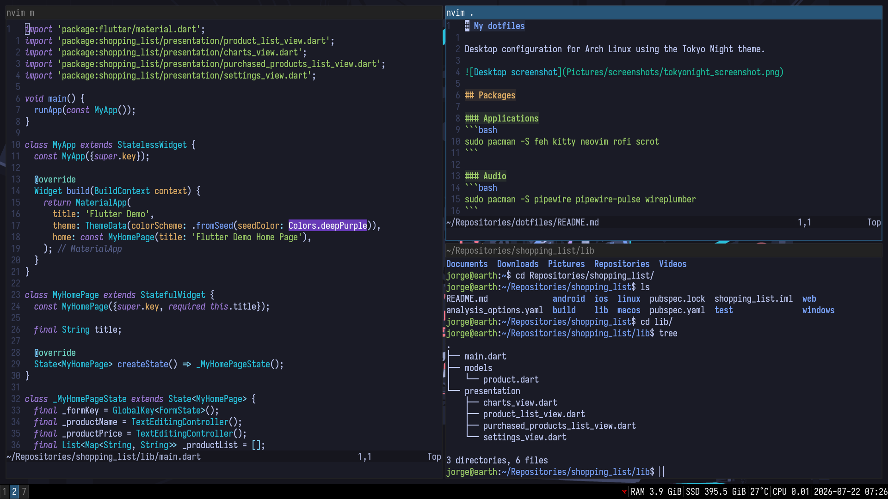

# My dotfiles

Desktop configuration for Arch Linux using Tokyo Night theme.



## Packages

### Applications
```bash
sudo pacman -S feh kitty neovim rofi scrot
```

### Audio
```bash
sudo pacman -S pipewire pipewire-pulse wireplumber
```

### Fonts
```bash
sudo pacman -S ttf-iosevka-nerd
```

### Graphics
```bash
sudo pacman -S xorg-server xorg-xinit xorg-xrandr
```

### Window Manager
```bash
sudo pacman -S i3-wm i3lock i3status
```
