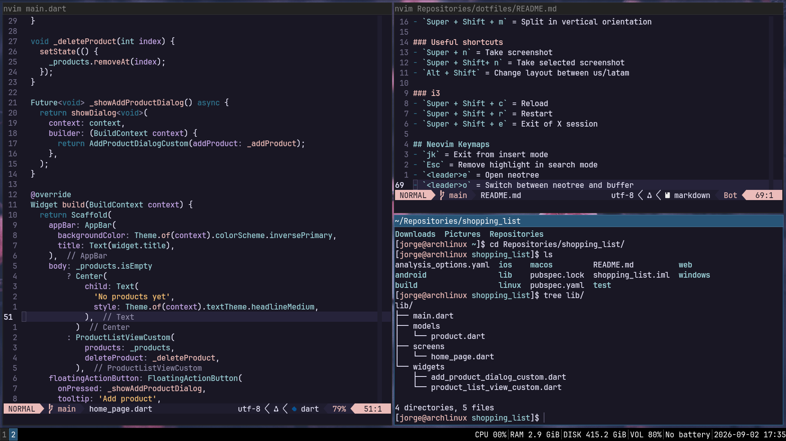

# My Arch Linux dotfiles



## Required packages
### Audio
```bash
sudo pacman -S pipewire pipewire-pulse wireplumber
```
### Apps
```bash
sudo pacman -S feh kitty neovim rofi scrot
```

### Font
```bash
sudo pacman -S ttf-jetbrains-mono-nerd
```

### Server
```bash
sudo pacman -S xorg-server xorg-xinit xorg-xrandr
```

### Window manager
```bash
sudo pacman -S i3-wm i3lock i3status
```

## Keymaps
### Open and close things
- `Super + Enter` = Terminal
- `Super + Shift + q` = Kill focused window
- `Super + d` = Rofi

### Volume
- `Super + bracketright` = Increase volume
- `Super + bracketleft` = Decrease volume
- `Super + semicolon` = Mute and unmute volume
- `Super + apostrophe` = Mute and unmute microphone

### Navigation
- `Super + h/j/k/l` = Change focus
- `Super + Shift + h/j/k/l` = Move focused window
- `Super + u/i/o/p/7/8/9/0` = change focus to another group
- `Super + Shift + u/i/o/p/7/8/9/0` = Move focus window to another group

### Window managing
- `Super + f` = Full sscreen toggle
- `Super + s` = Layout stacking
- `Super + w` = Layout tabbed (I use this to open a window)
- `Super + e` = Layout toggle split
- `Super + r` = Resize
- `Super + m` = Split horizontal
- `Super + Shift + m` = Split in vertical orientation

### Useful shortcuts
- `Super + n` = Take screenshot
- `Super + Shift+ n` = Take selected screenshot
- `Alt + Shift` = Change layout between us/latam

### i3
- `Super + Shift + c` = Reload
- `Super + Shift + r` = Restart
- `Super + Shift + e` = Exit of X session

## Neovim Keymaps
- `jk` = Exit from insert mode
- `Esc` = Remove highlight in search mode
- `<leader>e` = Open neotree
- `<leader>o` = Switch between neotree and buffer
